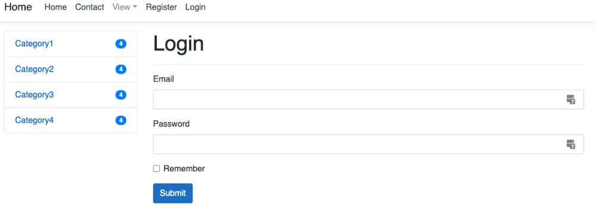

# Демо магазин мебели

## About

Backend: asp.net core

Frontend: html, css, js, bootstrap

## Installation

### Sql server

``docker docker pull mcr.microsoft.com/mssql/server:2019-latest``

``docker run -d --name SQL2019L -e 'ACCEPT_EULA=Y' -e 'SA_PASSWORD=PASSWORD-MY.234SEC' -p 1433:1433 mcr.microsoft.com/mssql/server:2019-latest``

### Migration 

``dotnet tool install--global dotnet-ef``

``dotnet ef database update``

### Run

``dotnet run``
